# Autonomous Research Agent — Architecture & Optimisations

A reference for **what the pipeline does**, **why each stage exists**, and **every cost/recall optimisation we layered on** during design.

---

## 1. End-to-end flow

```mermaid
flowchart TD
    Start([User research question]) --> A[Phase A — Preflight check<br/>is this question executable?]

    A -->|missing dimensions| Clarify[Show bilingual<br/>clarifying questions<br/>+ prompt template]
    Clarify --> Start

    A -->|executable| B1[Phase B1 — Bare schema<br/>id / label_he / label_en /<br/>type / temporal_anchor]
    B1 --> C[Phase C — Field-clarity audit<br/>unbounded / subjective /<br/>missing_anchor / ambiguous_format /<br/>no_canonical_source]
    C -->|issues| Fix[Show issues + fixes;<br/>user edits question]
    Fix --> Start
    C -->|all clear| D[Phase D — Mock preview<br/>2-3 fake rows so user<br/>can sanity-check shape]
    D --> Approve{User approves?}
    Approve -->|no| Start

    Approve -->|yes| B2[Phase B2 — Query enrichment<br/>• search_queries_he / _en<br/>• preferred_source_domains<br/>• directory_probe_query_he<br/>• extraction_strategy<br/>&nbsp;&nbsp;&nbsp;&nbsp;value_regex<br/>&nbsp;&nbsp;&nbsp;&nbsp;value_anchors_he/_en]

    B2 --> P0[Phase 0 — Field-list probes<br/>one search per field<br/>using directory_probe_query_he]
    P0 --> ProbeCheck{Top result covers<br/>≥ 25% of entities<br/>OR has list/table keywords?}
    ProbeCheck -->|hit| Bulk["bulk_extract_from_source<br/>one Claude call →<br/>value per entity"]
    ProbeCheck -->|miss| NoBulk[No probe data<br/>for this field]
    Bulk --> EntLoop
    NoBulk --> EntLoop

    EntLoop[Phase 1 — Entity loop] --> ForEach{For each entity}

    ForEach --> L1[Lane 1 — Probe-covered fields]
    L1 --> Verify1[verify_probe_extraction<br/>focused search using found<br/>VALUE as anchor → independent<br/>corroboration on different domain]

    Verify1 --> L2[Lane 2 — Non-deferred,<br/>non-probe fields]
    L2 --> Gather[Gather pages for ALL fields,<br/>dedupe URLs across fields<br/>via shared seen_urls;<br/>session page cache avoids<br/>re-fetching same URL across<br/>entities]
    Gather --> Score[Window each page with<br/>strategy-aware scoring:<br/>• keyword density<br/>• regex match +5<br/>• entity+anchor +3<br/>• greedy top-K by score<br/>• safety net falls back<br/>&nbsp;&nbsp;to pure keywords if<br/>&nbsp;&nbsp;strategy too narrow]
    Score --> BatExt["batch_extract_fields_from_source<br/>ONE Claude call per unique<br/>page → ExtractionResult per<br/>field. Memory-aware single<br/>extract when only 1 field"]

    BatExt --> L3[Lane 3 — Deferred fields<br/>processed after Lane 2<br/>resolves dependencies]
    L3 --> Batch2[Same batched extract<br/>for deferred fields]

    Batch2 --> VF[verify_field<br/>• independent-domain<br/>&nbsp;&nbsp;corroboration count<br/>• confidence HIGH/MEDIUM/<br/>&nbsp;&nbsp;LOW/NOT_FOUND<br/>• conflict / preferred-source<br/>&nbsp;&nbsp;flags]
    VF --> NextEnt{More entities?}
    NextEnt -->|yes| ForEach
    NextEnt -->|no| Out[CSV / JSON output]
```

---

## 2. Three lanes per entity (cheat sheet)

| Lane | Fields included                                    | How extraction happens                                                                                                    |
| :--: | :------------------------------------------------- | :------------------------------------------------------------------------------------------------------------------------ |
| **1**| Fields where the **probe** found this entity       | Use the probe extraction + **one verification search** with the found value as anchor. Different-domain check guards corroboration. |
| **2**| All other non-deferred fields                      | **One batched extract per unique page**. Pages are deduped across all of Lane 2's fields via shared `seen_urls`. The page-content cache also avoids re-fetching URLs seen for previous entities. |
| **3**| `depends_on` fields, after their dep resolves      | Same batched-extract path as Lane 2.                                                                                       |

---

## 3. Optimisations, one by one

Each entry: **what**, **why**, **cost impact**, **where in code**.

### 3.1 Multi-phase compiler (A → B1 → C → D → B2)

* **What:** instead of one giant prompt that produces a full plan, the compiler is split into preflight (A), bare schema (B1), audit (C), mock preview (D), and **query enrichment (B2)** that only runs after the user has approved the schema.
* **Why:** rejecting a bad schema in Phase A or C costs almost no tokens. The expensive part (per-field search queries, preferred domains, probe queries, extraction strategies) only runs when we know it won't be thrown away.
* **Where:** `research_agent/compiler.py` — `compile_schema()`, `audit_schema()`, `generate_mock_rows()`, `enrich_with_queries()`.

### 3.2 Field-clarity audit (Phase C)

* **What:** Haiku inspects every column and flags **unbounded / subjective / missing_anchor / ambiguous_format / no_canonical_source** issues with bilingual explanations and suggested fixes.
* **Why:** catches "career path" (unbounded), "best mayor" (subjective), "mayor" without a temporal anchor — *before* a single search is run.
* **Where:** `audit_schema()` + `_AUDIT_TOOL`.

### 3.3 Probe model — field-list axis

* **What:** before the entity loop, for each field run **one entity-agnostic search** (e.g. `"רשימת ראשי ערים ישראל 1990"`). If a result page covers ≥ 25% of target entities (or ≥ 2 entities with directory keywords), extract for **all entities in one Claude call** (`bulk_extract_from_source`).
* **Why:** for fields like "founding year" or "1990 mayor", a single directory page often answers half or all of the entities. Replaces N searches + N Claude calls with 1 + 1.
* **Where:** `probe_field_list()`, `bulk_extract_from_source()` in `extractor.py`.

### 3.4 Probe verification search

* **What:** for every probe-found cell, run **one focused search** using the *found value* as the query anchor (`'"{value}" {entity} {temporal_anchor}'` — or just `{url}` for URL fields). Filters out same-domain results. Combines with probe extraction before going to `verify_field`.
* **Why:** the probe gives one source. Identity facts need `min_corroborations ≥ 2`. A value-anchored query is much higher-precision than the original entity query and is unlikely to return the same directory page again, so we get genuinely independent evidence.
* **Where:** `verify_probe_extraction()`.

### 3.5 Entity-page deduplication

* **What:** within one entity, the same page (often Wikipedia for that entity) appears in search results for multiple fields. We now extract from each unique page **once**, in a single Claude call that returns a value per field (`batch_extract_fields_from_source`).
* **Why:** without this, the Wikipedia article for Tel Aviv was sent to Claude three times for three fields. Now: one call.
* **Where:** `search_and_extract_batched()`, `batch_extract_fields_from_source()`.

### 3.6 Session page-content cache

* **What:** each search client (`DuckDuckGo`, `SerpApi`, `Google`) keeps an instance-level `{url → content}` cache. `_fetch()` reads the cache before hitting the network.
* **Why:** when a page appears in results for multiple entities (e.g. a long Knesset history page mentioning many cities), we used to fetch + HTML-strip it once per entity. Now: once per run.
* **Smart cross-page search:** caching stores **raw content only**. Per-entity re-windowing (`_select_relevant_text`) keys on the current entity name, so for Tel Aviv we still get Tel Aviv's section, for Haifa we get Haifa's — independent of whose call populated the cache first.
* **Where:** `_page_cache` attribute on each client class.

### 3.7 LLM-generated extraction strategies

* **What:** Phase B2 emits an optional `extraction_strategy` per field:
  * `value_regex` — literal value format (e.g. `r'https?://\S+\.(gov|muni|org)\.il'`)
  * `value_anchors_he` / `value_anchors_en` — short context phrases the value typically sits near
* **Why:** for fields like URLs, a regex is essentially a value-finder. For year/number fields, `\d{4}` slices huge swaths of irrelevant text. For person_name in long bios, anchors like `"כיהן כראש העיר"` push the right paragraph above unrelated biography sections.
* **Scoring:**
  * keyword density → baseline (unchanged)
  * regex match in chunk → **+5**
  * entity name + anchor in same chunk → **+3**
* **Safety net:** bad regex is caught (logged + ignored). If max chunk score with strategy active is below 2, we **re-score with pure keyword density** — guarantees a bad strategy can't tank recall.
* **Where:** `ExtractionStrategy` in `models.py`, generated in `enrich_with_queries`, consumed by `_compile_strategies()` + `_score_chunk()` in `extractor.py`.

### 3.8 Score-aware windowing (bug fix)

* **What:** the old windowing merged *every* chunk with at least one keyword hit into one giant interval, then walked it left-to-right until the budget ran out. A swarm of low-score filler chunks at the top of the page could consume the budget before any high-score chunk further down was reached.
* **Now:** **greedy top-K by score with overlap rejection**. Highest-scoring chunk wins, then the next highest non-overlapping chunk, until budget is full. Position-sorted only at output time.
* **Why it matters:** without this, the regex/anchor boosts above don't actually surface the buried passage. Verified with a 41K-char synthetic where the target URL is at position 22K — the new windowing picks it; the old one returned only filler.
* **Where:** `_select_text_by_keywords()` in `extractor.py`.

### 3.9 Wikidata structured injection

* **What:** for fields of type `url` or `person_name` queried via Wikipedia, also query Wikidata for the structured equivalent — `P856` (official website), `P6` (head of government, filtered by tenure dates).
* **Why:** Wikipedia plaintext loses tabular structure. Wikidata gives the canonical value as a structured fact with sourceable QID.
* **Where:** `_inject_wikidata()`.

### 3.10 Density windowing with type-specific keywords

* **What:** a per-field-type keyword dict (`_TYPE_KEYWORDS`) injects useful tokens into the keyword set — e.g. for `url`: `["www.", "http", ".gov", ".il", "אתר רשמי", "official site"]`. Year fields auto-add `temporal_anchor ± 3` years.
* **Why:** field labels alone are often not enough; the value-format hints raise the score of the actual answer's neighbourhood.
* **Where:** `_TYPE_KEYWORDS`, `_field_keywords()`.

### 3.11 Wikipedia canonical title for Wikidata lookup

* **What:** before calling Wikidata, fetch the entity's Wikipedia article first (which follows redirects) and use the **post-redirect title** as the Wikidata sitelink key.
* **Why:** Wikidata sitelinks are keyed on canonical titles. `תל אביב` → Wikidata: not found; `תל אביב-יפו` → Q33935: found.
* **Where:** `_gather_pages_for_field()`.

### 3.12 Targeted error handling (Anthropic-specific)

* **What:** a global exception handler in the API translates Anthropic errors to actionable HTTP codes:
  * `BadRequestError` with "credit balance" → **402** with a concrete top-up message
  * `AuthenticationError` → **401** "Invalid `ANTHROPIC_API_KEY`"
  * `RateLimitError` → **429** with retry hint
  * `APIConnectionError` → **503** with the upstream message
  * Generic exception → **500** with the exception class name
* **Why:** the original generic "error" message was useless. Now the frontend renders a useful message and the dev terminal still has the full traceback.
* **Where:** `_translate()` + `all_exceptions_handler()` in `api/main.py`.

---

## 4. Cost-impact summary

For a stylised run of **10 entities × 3 fields** where:

* 2 of the 3 fields have a usable directory page (probe hits)
* The Wikipedia article for each entity contains data for all 3 fields

|                                     | Searches | Claude extract calls | Notes                                                                                       |
| :---------------------------------- | -------: | -------------------: | :------------------------------------------------------------------------------------------ |
| **Naive baseline** (one per cell)   |       30 |                   30 | Pre-optimisation.                                                                            |
| **+ Entity-page dedup**             |       30 |                  ~10 | Wikipedia article goes once per entity instead of 3×.                                        |
| **+ Probe (2 fields covered)**      |     **12** |                **~12** | 2 probe searches + 2 bulk-extract calls cover those 2 fields × 10 entities.                  |
| **+ Probe verification search**     |       32 |                  ~32 | Each probe-found cell costs +1 search + 1 Claude call for independent corroboration.         |
| **+ Page cache**                    |   same   |                 same | Free win on time/network, not on Claude/SerpAPI costs.                                       |
| **Net result**                      |   ~32    |                 ~32 | Plus much higher data integrity than the "skip search after probe" alternative (no `LOW` cells with `below_min_corroborations`). |

The headline takeaway: **what we save on extraction we partially spend on verification.** Net cost is roughly even with naive, but the data is *meaningfully* better — each probe-found value gets a second independent source, and entity-page dedup keeps shared pages from being processed three times.

---

## 5. Residual risks (honest)

Not all gaps are optimisation problems. Some are recall risks that no clever pipeline fully solves:

* **Tabular / infobox data** — `_strip_html` flattens tables. A Wikipedia infobox row "ראש העיר 1990 → שלמה להט" becomes context-less plain text and may not ground.
* **Long-tail entities** — a small municipality's 1990 mayor may not be on the indexed web at all.
* **Hebrew name variants** — "תל אביב" vs "תל אביב-יפו"; "להט" vs "שלמה להט" vs "צ'יץ'". One redirect-follow at the Wikipedia layer; no general entity resolution.

These are documented here so future work can target them deliberately, rather than be surprised by them.

---

## 6. Files of interest

| File                                  | What lives there                                                                                          |
| :------------------------------------ | :-------------------------------------------------------------------------------------------------------- |
| `research_agent/models.py`            | `ColumnPlan`, `ResearchPlan`, `ExtractionStrategy`, `FieldAuditReport`, `MockRow`, …                       |
| `research_agent/compiler.py`          | Phases A / B1 / C / D / B2 (`compile_schema`, `audit_schema`, `generate_mock_rows`, `enrich_with_queries`) |
| `research_agent/extractor.py`         | Probe model, batched extraction, page cache, windowing, search clients, Wikidata injection                |
| `research_agent/verifier.py`          | Confidence + corroboration + conflict / preferred-source flags                                            |
| `api/main.py`                         | FastAPI endpoints + SSE streaming; Anthropic error translation                                            |
| `main.py`                             | CLI entry point + interactive Stage-0 loop                                                                |
| `web/src/*`                           | React + Vite + Tailwind frontend, Hebrew RTL                                                              |
